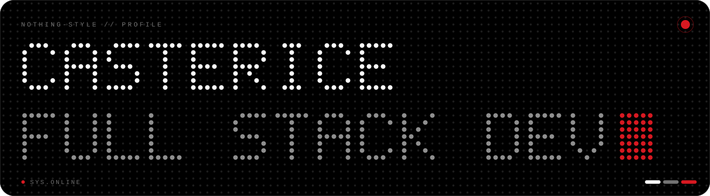

<div align="center">

<picture>
  <source media="(prefers-color-scheme: light)" srcset="assets/banner-light.svg">
  
</picture>

<a href="https://git.io/typing-svg"></a>

</div>


### `[ 01 ] SOBRE MÍ`

```text
┌──────────────────────────────────────────────┐
│  NOMBRE     : Casterice                      │
│  ROL        : Full Stack Developer           │
│  UBICACIÓN  : Guatemala, GT                  │
│  ENFOQUE    : Web apps limpias y rápidas     │
│  AHORA      : Construyendo con React + Next  │
│  APRENDIENDO: NestJS                         │
│  AMO        : Guatemala ♥                    │
│  ESTADO     : ● ONLINE                       │
└──────────────────────────────────────────────┘
```


### `[ 02 ] STACK`

<p>
  
  
  
  
  
  
  
  
</p>

<sub><code>● APRENDIENDO</code></sub>&nbsp;


### `[ 03 ] STATS`

<p align="center">
  
  
</p>

<p align="center">
  
</p>


### `[ 04 ] PROYECTOS`

| ● | PROYECTO | DESCRIPCIÓN | STACK |
|---|----------|-------------|-------|
| 🔴 | [**Luna-link-in-bio**](https://github.com/Casterice/Luna-link-in-bio) | Página link-in-bio minimalista | `Web` |
| ⚪ | [**ale-vale-cumple**](https://github.com/Casterice/ale-vale-cumple) | Sitio de cumpleaños personalizado | `TS` |
| ⚪ | [**MEAN**](https://github.com/Casterice/MEAN) | API REST con stack MEAN | `Node` `Mongo` |


### `[ 05 ] CONTACTO`

<p>
  <a href="mailto:joanrandy34@gmail.com"></a>
</p>

<div align="center">
  <sub><code>● SYS.ONLINE &nbsp;//&nbsp; HECHO EN GUATEMALA 🇬🇹 &nbsp;//&nbsp; DESIGNED IN DOTS</code></sub>
</div>
